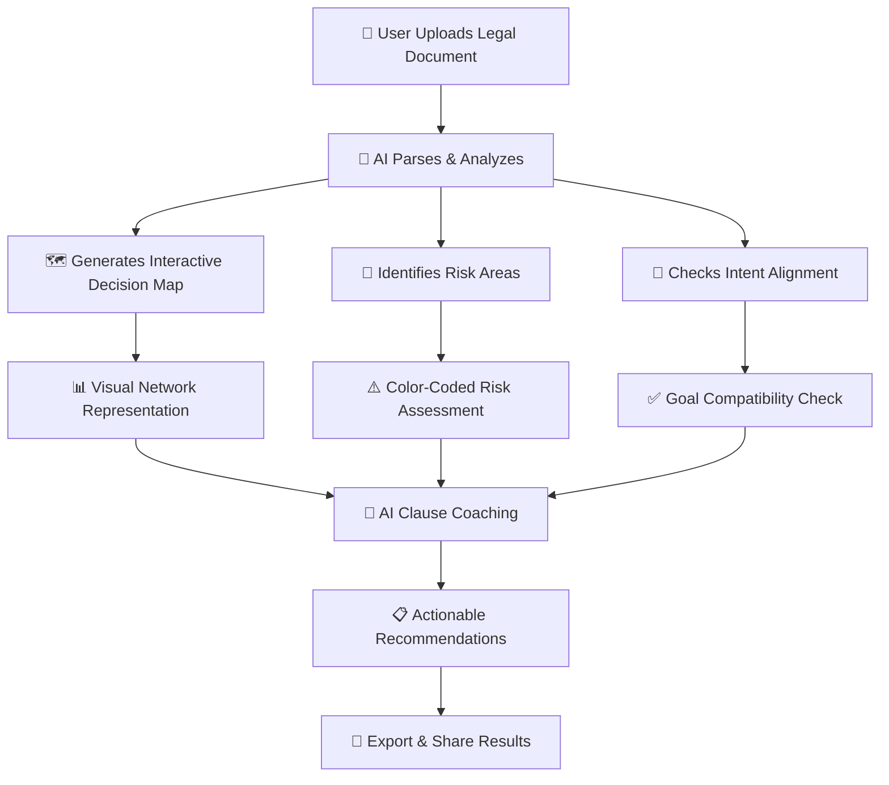
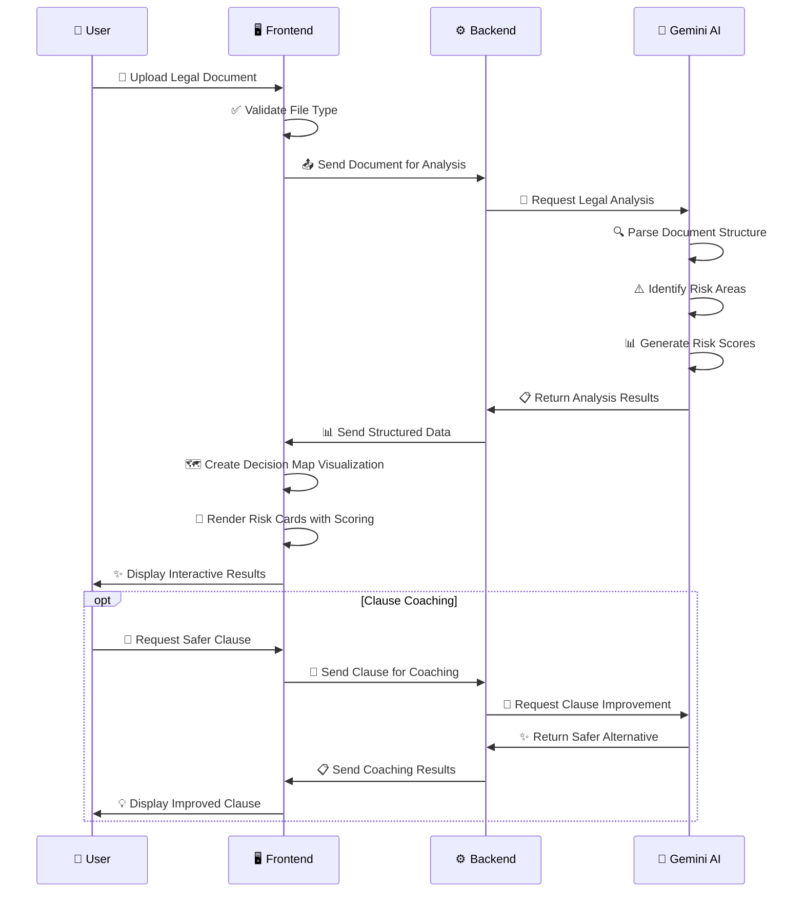
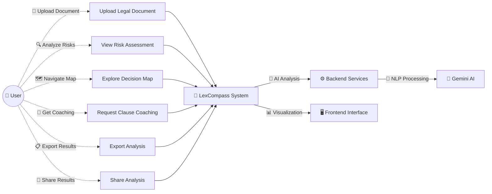
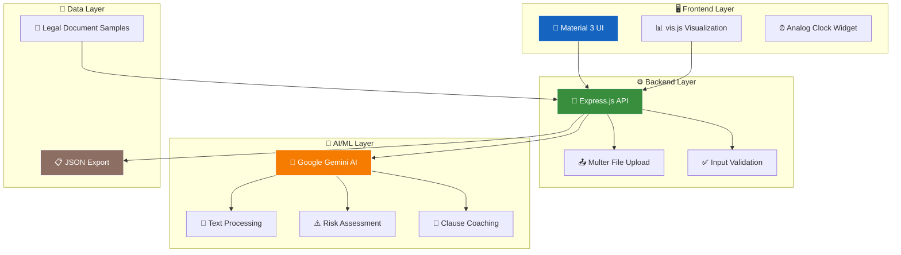

# ⚖️ LexCompass — From Legal Documents to Legal Decisions™

## 🎯 Challenge Selected

**Generative AI for Demystifying Legal Documents**
_(Also fits under LegalTech / FinTech challenges)_

Legal documents are intimidating, complex, and often inaccessible to ordinary people. Most AI tools summarize — but they don't empower. We're solving legal literacy + decision-making + negotiation with an intent-aligned, anxiety-aware AI platform.

---

## 📋 Brief About Solution

🧭 **LexCompass transforms any legal document into an interactive decision map**, personalized to each user's intent, risk profile, and emotional comfort. Unlike generic summarizers, it acts as a **Legal GPS**, showing obligations, risks, and negotiation opportunities in a visual, voice-friendly, and emotionally intelligent interface.

Users don't just read — they **navigate**: see outcomes, forecast risks, align with goals, and even generate safer negotiation clauses. This empowers freelancers, employees, tenants, startups, and everyday citizens to understand, trust, and act on legal agreements.

---

## 🔹 USP of the Solution

- 🗺️ **Legal GPS Mode** → Converts contracts into outcome-based decision flows
- 🎯 **Intent Alignment Engine** → Compares clauses vs. user goals
- 🚨 **Risk Radar™** → AI-powered clause-level risk forecasting
- 💼 **Clause Coach™** → Negotiation mentor with rewrite + copy-paste templates
- 🧠 **Emotion Layer** → Anxiety-aware AI UX that adapts tone & visuals
- 🎧 **Audio Buddy** → Explains clauses in local dialects, voice, and stories
- 📱 **Multi-modal output** → Text + Visual map + Voice explanation
- 🌟 **Moonshot Vision** → AR/3D "Holographic Law" visualization

---

## 🔍 How is LexCompass Different from Existing Solutions?

### 🆚 **vs. Traditional Legal AI Tools:**

- **Beyond Summarization** → Provides actionable, intent-aligned decision maps
- **Emotionally Intelligent** → Adapts explanations based on user anxiety and comfort
- **Negotiation-Ready** → Suggests safer clause rewrites and templates
- **Multi-modal Accessibility** → Text, visual, and audio explanations
- **Personalized Risk Assessment** → Context-aware risk scoring with visual indicators

### 🆚 **vs. Legal Document Platforms:**

- **Real-time AI Analysis** → Instant risk identification and coaching
- **Interactive Visualization** → Decision trees instead of static text
- **User Intent Alignment** → Checks if contract matches personal goals
- **Anxiety-Aware UX** → Reduces legal intimidation through design

---

## 🛠️ How Does It Solve the Problem?

### **Problem-Solution Flow:**

1. 📖 **Extracts** obligations, options, deadlines, and risks from contracts
2. 🗺️ **Builds interactive decision map**: "If I do X → Y happens"
3. 🎯 **Checks** contract alignment with user's stated intent
4. 🚨 **Flags** high-risk/unfair clauses with AI-driven risk scores
5. 💡 **Suggests** improved clauses for safer negotiation
6. 🗣️ **Explains** in simple, anxiety-aware language (text, visuals, voice)
7. ⚡ **Empowers** users to negotiate and make informed decisions

---

## 🚀 Unique Selling Proposition (USP)

> **🧭 LexCompass is the first platform to combine legal AI, risk analysis, negotiation coaching, and emotional intelligence into a single, accessible tool. It empowers users to not just understand, but confidently act on legal documents.**

### **🌟 Key Differentiators:**

- **🧠 AI-Powered Legal GPS** - Navigate documents like a map, not a book
- **🎯 Intent-Aligned Analysis** - Personalized to your specific goals
- **🚨 Predictive Risk Assessment** - 1-10 scoring with color-coded warnings
- **💼 Active Clause Coaching** - AI suggests safer alternatives with explanations
- **🎨 Anxiety-Aware Design** - Reduces legal intimidation through UX psychology
- **📱 Multi-Modal Accessibility** - Visual, audio, and text explanations

---

## 📊 MVP (Minimum Viable Product) Features

### ✅ **Core Features Implemented:**

1. **📄 Document Upload & Analysis** - AI-powered parsing of legal documents
2. **🗺️ Interactive Decision Map** - Visual network representation of document structure
3. **🚨 Risk Radar™** - Color-coded risk assessment with 1-10 scoring
4. **💼 Clause Coach™** - AI suggestions for safer clause alternatives
5. **📱 Material 3 UI** - Professional legal office aesthetic with real-time clock
6. **📋 Export Functionality** - Download analysis results in JSON format

### 🎯 **MVP Questions Answered:**

**Q: What problem does your MVP solve?**
A: Legal documents are intimidating and risky for non-lawyers. Our MVP transforms complex contracts into visual, interactive maps with AI-powered risk identification and coaching, making legal decisions accessible and safer.

**Q: Who is your target user?**  
A: Freelancers, employees, tenants, small business owners, and everyday citizens who encounter legal documents but can't afford lawyers.

**Q: What's the core value proposition?**
A: Turn legal anxiety into legal confidence through AI-powered visualization, risk assessment, and coaching.

**Q: How does it differ from existing solutions?**
A: We don't just summarize—we visualize, assess risk numerically, provide coaching, and adapt to user anxiety levels.

---

## 🎨 List of Features Offered by the Solution

### 🔧 **Technical Features:**

- **🤖 AI Document Analysis** (Google Gemini API integration)
- **🗺️ Interactive Decision Maps** (vis.js network visualization)
- **🚨 Risk Scoring System** (1-10 scale with color coding)
- **💼 Clause Coaching Engine** (AI-powered suggestions)
- **📱 Material 3 Design** (Professional legal office aesthetic)
- **⏰ Real-time Analog Clock** (Vector-based time display)
- **📋 Export & Share** (JSON analysis export)
- **🔔 Smart Notifications** (Material toast notifications)

### 👥 **User Experience Features:**

- **🎯 File Upload with Visual Feedback**
- **⚡ Real-time Loading States**
- **📊 Color-coded Risk Visualization**
- **💡 Copy-to-Clipboard Functionality**
- **📱 Responsive Mobile Design**
- **🔄 Smooth Animations & Transitions**

---

## 📈 Process Flow Diagram

---

## 🏗️ Use Case Diagram

---

## 🏛️ Architecture Diagram

---

## 🛠️ Technologies Used in the Solution

### 🌐 **Frontend Technologies:**

- **⚡ HTML5 + CSS3** - Modern web standards
- **🎨 Tailwind CSS** - Utility-first styling framework
- **📱 Material 3 Design** - Google's latest design system
- **📊 vis.js** - Network visualization library for decision maps
- **⏰ Custom Analog Clock** - Vector-based time widget
- **🔤 Google Fonts** - Roboto + Inter typography
- **🎯 Vanilla JavaScript** - No heavy frameworks for performance

### ⚙️ **Backend Technologies:**

- **🟢 Node.js** - JavaScript runtime environment
- **🚀 Express.js** - Minimal web application framework
- **📤 Multer** - File upload middleware
- **🌐 CORS** - Cross-origin resource sharing
- **🔒 dotenv** - Environment variable management

### 🤖 **AI/ML Technologies:**

- **🧠 Google Gemini 1.5 Flash** - Large language model
- **📚 @google/generative-ai** - Official Google AI SDK
- **📝 Natural Language Processing** - Text analysis and extraction
- **⚠️ Custom Risk Scoring** - AI-driven risk assessment algorithm
- **💼 Prompt Engineering** - Optimized legal analysis prompts

### 🎨 **Design & UX:**

- **📐 Material 3 Color Scheme** - Consistent design tokens
- **🎨 CSS Custom Properties** - Dynamic theming
- **⚡ CSS Transitions** - Smooth animations
- **📱 Responsive Design** - Mobile-first approach
- **♿ Accessibility Features** - Screen reader friendly

### 🔧 **Development Tools:**

- **📝 VS Code** - Code editor with extensions
- **🌿 Git** - Version control
- **📦 npm** - Package management
- **🔍 Chrome DevTools** - Debugging and optimization

---

## 📄 Brief About the Prototype

### 🎯 **What This MVP Demonstrates:**

Our **LexCompass prototype** is a fully functional web application that showcases the core vision of transforming legal documents into interactive, visual decision-making tools. Built in just a few hours for hackathon submission, it demonstrates:

1. **📄 Document Upload & AI Analysis** - Upload .txt legal documents for instant AI processing
2. **🗺️ Interactive Decision Maps** - Visual network diagrams showing document structure and relationships
3. **🚨 Risk Radar™ with Scoring** - Color-coded risk assessment (1-10 scale) with detailed explanations
4. **💼 AI Clause Coaching** - Get safer clause alternatives with explanations of legal improvements
5. **📱 Professional UI** - Material 3 design with legal office aesthetic and working analog clock
6. **📋 Export Functionality** - Download complete analysis results for sharing

### 🎪 **Live Demo Experience:**

- **Upload** sample documents (employment contracts, rental leases, loan agreements)
- **Visualize** document structure as an interactive network graph
- **Identify** high-risk clauses with AI-powered scoring (🔴 Critical, 🟠 High, 🟡 Medium, 🟢 Low)
- **Improve** problematic clauses with AI coaching suggestions
- **Export** analysis results for further review

### 🏗️ **Technical Implementation:**

- **Frontend:** Material 3 design with Tailwind CSS, vis.js visualizations, analog clock widget
- **Backend:** Node.js + Express with Google Gemini AI integration
- **AI Engine:** Advanced prompt engineering for legal document analysis and risk assessment
- **Sample Data:** Diverse legal documents including problematic, semi-legal, and fair agreements

**🔗 Prototype Link:** _[To be deployed on GitHub Pages or similar platform]_

---

## 🎯 Final Pitch One-Liner

> **⚖️ LexCompass turns intimidating legal documents into interactive decision maps — powered by intent-aligned AI, risk forecasting, negotiation coaching, and anxiety-aware UX. It doesn't just simplify law — it empowers users to navigate it confidently.**

---

_📧 Built with ❤️ for the hackathon - Making legal literacy accessible to everyone through AI innovation_
